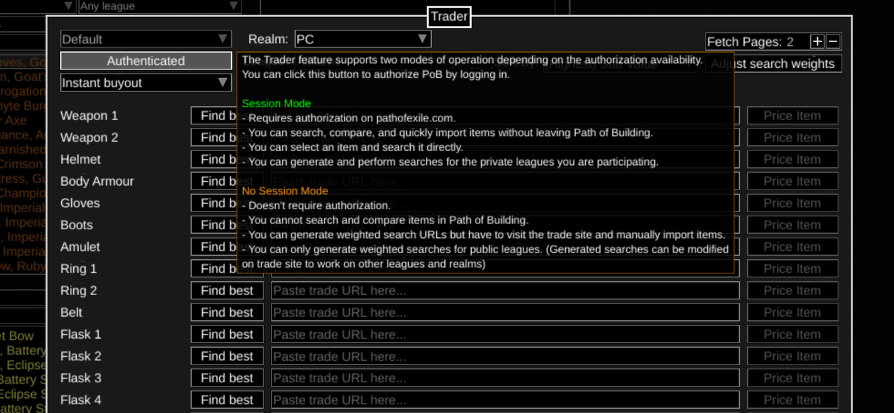

# Tools

## Path of Building

> [Download here](https://pathofbuilding.community/)

### Get your gear upgrades with PoB

1. Authenticate to PoB

2. Items -> Trade for these items

3. Check that your authenticated. After that choose "Find best" from the slot where you want to get the upgrade

## Path of Exile Unique Disenchanting Tool

- https://poe-disenchant-tool.vercel.app/allflame
