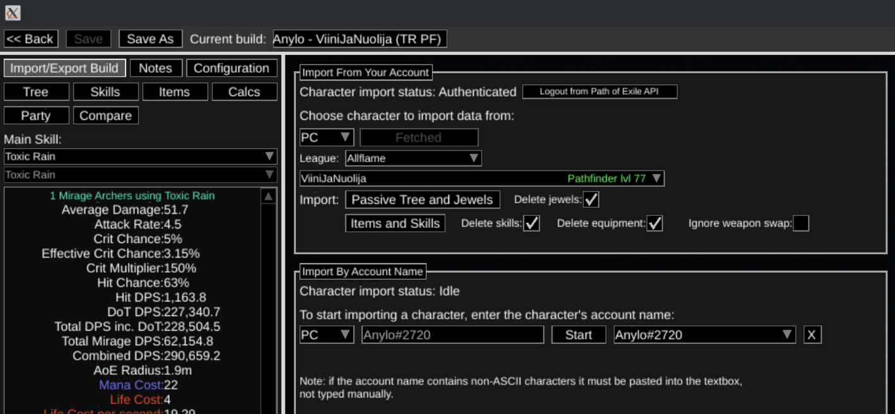
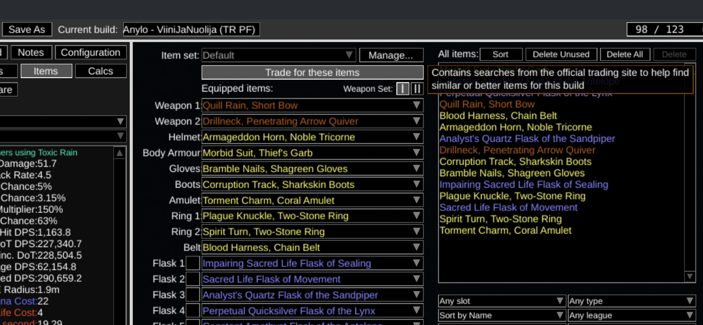
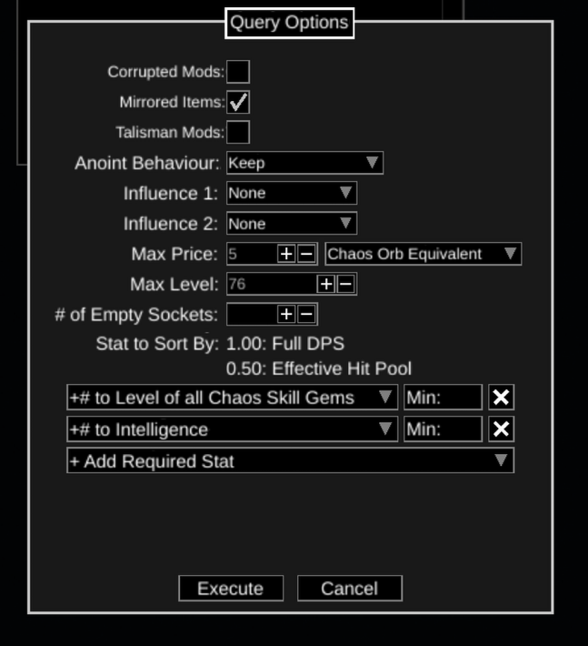

# Tools

## Path of Building

> [Download here](https://pathofbuilding.community/)

### Get your gear upgrades with PoB

1. Authenticate to PoB

2. Items -> Trade for these items

3. Check that your authenticated. After that choose "Find best" from the slot where you want to get the upgrade

4. Select query options (max price, max level etc) and select Execute

## Path of Exile Unique Disenchanting Tool

- https://poe-disenchant-tool.vercel.app/allflame
